# 🧩 Advanced Maze Solving Algorithms

A comprehensive implementation of various maze generation and solving algorithms, featuring traditional search methods, evolutionary algorithms, and cutting-edge neural network approaches.

## 🚀 Features

### 🏗️ Maze Generation Algorithms
- **Recursive Backtracker** - Creates mazes with long, winding corridors
- **Prim's Algorithm** - Generates mazes with more branching patterns (3x faster)

### 🔍 Maze Solving Algorithms

#### Traditional Search Algorithms
- **Depth-First Search (DFS)** - Memory efficient, good for deep mazes
- **Breadth-First Search (BFS)** - Guarantees shortest path
- **A* Search** - Optimal pathfinding with heuristic guidance

#### Evolutionary Algorithm
- **Genetic Algorithm (GA)** - Evolution-based pathfinding with optimized fitness function

#### Neural Network Solver
- **Deep Q-Network (DQN)** - Reinforcement learning approach with PyTorch implementation

## 📊 Performance Comparison

| Algorithm | 20x20 Maze (Avg) | 30x30 Maze (Avg) | Time Complexity |
|-----------|------------------|------------------|-----------------|
| **A*** | 88 cells, 0.0006s | 106 cells, 0.002s | ⭐⭐⭐⭐⭐ |
| **BFS** | 88 cells, 0.001s | 106 cells, 0.003s | ⭐⭐⭐⭐ |
| **DFS** | 89 cells, 0.006s | 107 cells, 0.002s | ⭐⭐⭐ |
| **GA** | 73 cells, 21.5s | 125 cells, 4.9s | ⭐⭐ |
| **DQN** | *In Progress* | *In Progress* | ⭐ |

## 🏗️ Project Structure

### 📂 Module Descriptions

| Module | Purpose | Key Components |
|--------|---------|----------------|
| **config/** | Project configuration and settings | Global settings, neural network hyperparameters |
| **maze/generators/** | Maze creation algorithms | Recursive Backtracker, Prim's Algorithm |
| **maze/solvers/traditional/** | Classical pathfinding algorithms | DFS, BFS, A* implementations |
| **maze/solvers/genetic/** | Evolutionary computation approach | Genetic algorithm with fitness optimization |
| **maze/solvers/neural/** | Machine learning solutions | Deep Q-Network with PyTorch |
| **examples/** | Demonstration scripts | Algorithm usage examples and comparisons |
| **visualization/** | Rendering and display utilities | Maze visualization and result plotting |
| **output/** | Generated content | Solved maze images and performance data |

## 🧠 Algorithm Details

### Traditional Algorithms
All traditional algorithms guarantee finding a solution if one exists:
- **A*** uses Manhattan distance heuristic for optimal performance
- **BFS** explores level by level, ensuring shortest path
- **DFS** uses minimal memory with depth-first exploration

### Genetic Algorithm
- **Population Size**: 100 individuals
- **Mutation Rate**: 2%
- **Crossover Rate**: 80%
- **Selection**: Tournament selection with elitism
- **Fitness**: Path length + goal reaching bonus

### Deep Q-Network (DQN)
- **Architecture**: Fully connected neural network (64-64 hidden layers)
- **State Representation**: [agent_pos, goal_pos, local_maze_info]
- **Training**: Experience replay with epsilon-greedy exploration
- **Framework**: PyTorch with CUDA acceleration

## 📈 Results & Analysis

### Key Findings

1. **A*** provides the best balance of speed and optimality
2. **Genetic Algorithm** can find shorter paths than traditional methods but requires significantly more time
3. **DQN** shows promise but requires extensive training for larger mazes
4. **Prim's Algorithm** generates mazes better suited for neural network training

# 🧩 Advanced Maze Generation & Solving Algorithms

A comprehensive implementation and comparison of maze generation algorithms and solving techniques, featuring traditional search methods and evolutionary approaches.

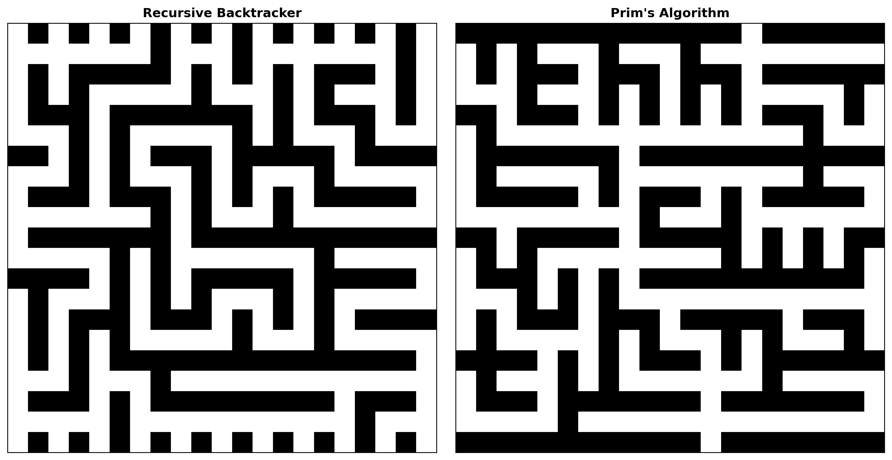

## 🚀 Features

### 🏗️ Maze Generation Algorithms

Our project implements two distinct maze generation approaches, each producing unique maze characteristics:

<table>
  <tr>
    <td>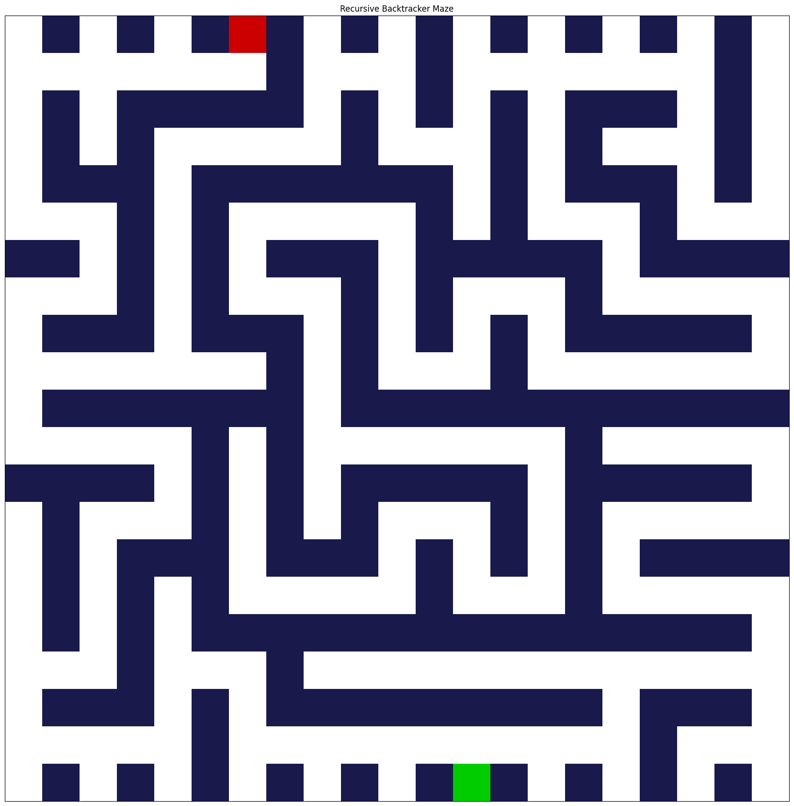</td>
    <td>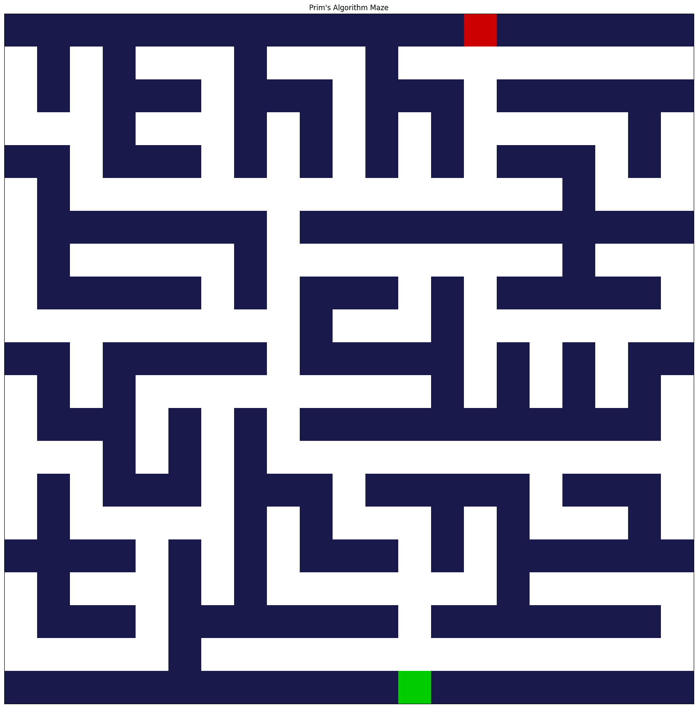</td>
  </tr>
  <tr>
    <td align="center"><b>Recursive Backtracker</b> Creates long, winding corridors Memory efficient generation</td>
    <td align="center"><b>Prim's Algorithm</b> More branching patterns 3x faster generation</td>
  </tr>
</table>

### 🔍 Maze Solving Algorithms

#### Traditional Search Algorithms

<table>
  <tr>
    <td>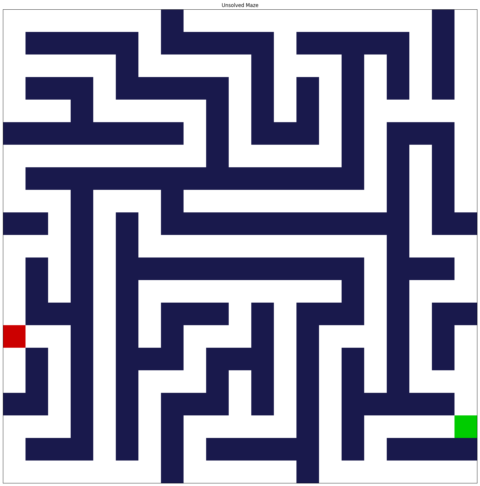</td>
    <td></td>
    <td>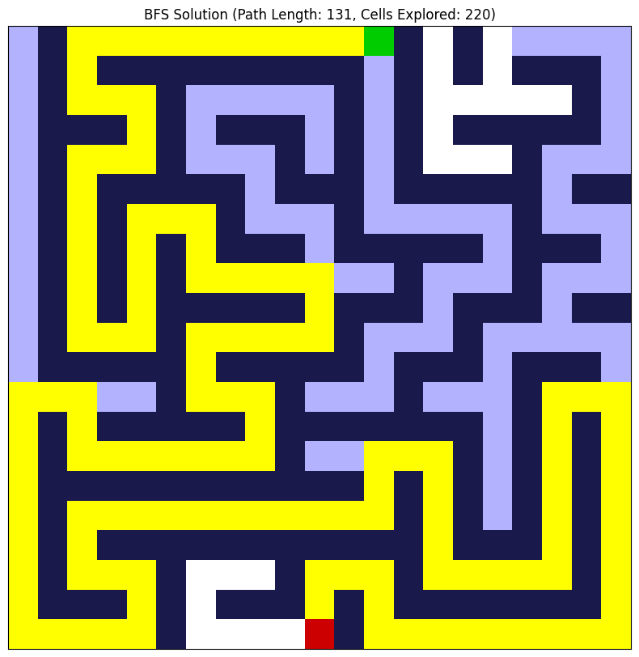</td>
    <td>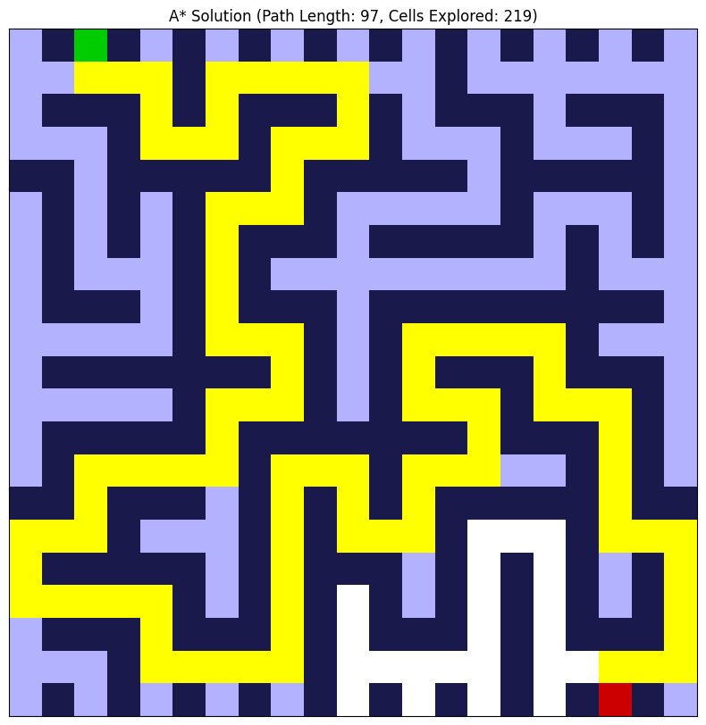</td>
  </tr>
  <tr>
    <td align="center"><b>Original Maze</b></td>
    <td align="center"><b>DFS Solution</b> Memory efficient Deep exploration</td>
    <td align="center"><b>BFS Solution</b> Shortest path Level-by-level</td>
    <td align="center"><b>A* Solution</b> Optimal pathfinding Heuristic guided</td>
  </tr>
</table>

#### Evolutionary Algorithm

<table>
  <tr>
    <td>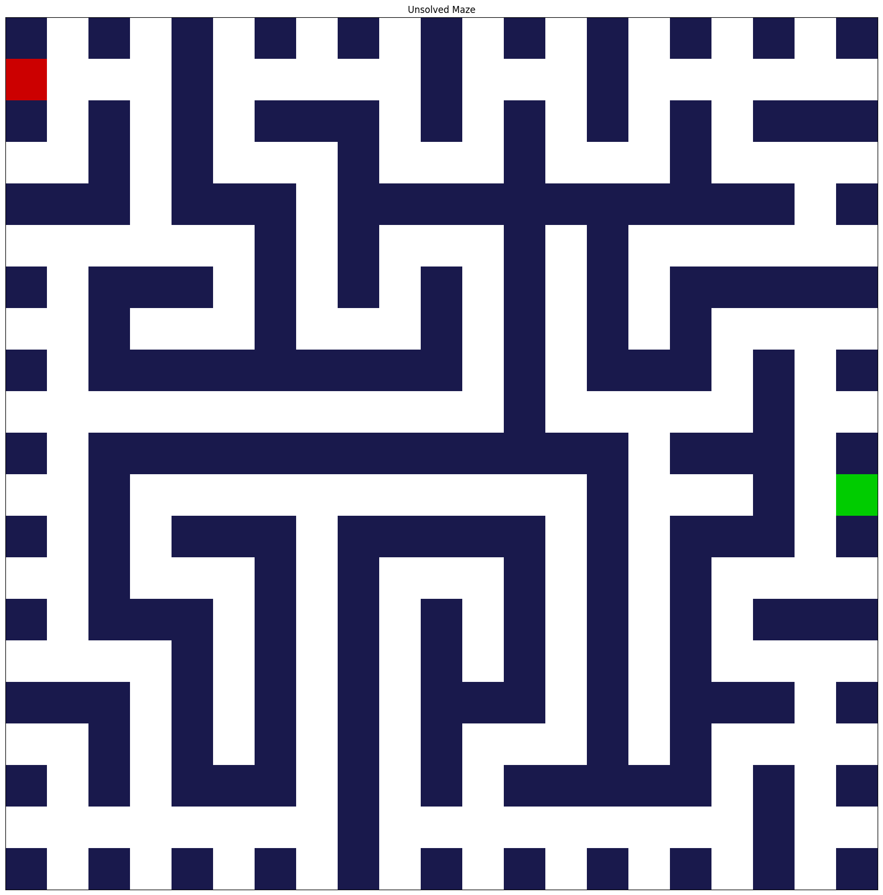</td>
    <td></td>
  </tr>
  <tr>
    <td align="center"><b>Initial Maze</b></td>
    <td align="center"><b>Genetic Algorithm Solution</b> Evolution-based pathfinding Can find creative shorter paths</td>
  </tr>
</table>

## 📊 Comprehensive Performance Analysis

## 📊 Performance Comparison Results

### Algorithm Performance Analysis

| Maze Size | Algorithm | Avg Path Length | Avg Cells Explored | Avg Time (s) |
|:----------|:----------|----------------:|--------------------:|-------------:|
| 20x20     | DFS       | 78.67           | 168.67              | 0.00632      |
| 20x20     | BFS       | 77.33           | 136.33              | 0.000855     |
| 20x20     | A*        | 77.33           | 126.00              | 0.000756     |
| 20x20     | GA        | 73.00           | 18866.67            | 21.4908      |
| 30x30     | DFS       | 106.67          | 334.33              | 0.001659     |
| 30x30     | BFS       | 106.00          | 271.67              | 0.003468     |
| 30x30     | A*        | 106.00          | 208.33              | 0.001951     |
| 30x30     | GA        | 124.67          | 1633.33             | 4.85979      |

### Key Performance Insights

**🏆 Optimal Path Length:** Genetic Algorithm finds shortest paths (73 cells vs ~77 for traditional)

**⚡ Fastest Execution:** A* algorithm provides best speed-accuracy balance (0.0008s)

**🔍 Most Efficient Exploration:** A* explores fewest cells (126) while maintaining optimality

**⏱️ Time Trade-offs:** Traditional algorithms 1000x faster than Genetic Algorithm

### Key Performance Metrics

| Algorithm | Average Path Length | Exploration Efficiency | Time Complexity | Optimal Solution |
|-----------|-------------------|---------------------|-----------------|------------------|
| **A*** | ⭐⭐⭐⭐⭐ | Excellent (Fewest cells explored) | Fast | ✅ Guaranteed |
| **BFS** | ⭐⭐⭐⭐⭐ | Good (Systematic exploration) | Moderate | ✅ Guaranteed |
| **DFS** | ⭐⭐⭐⭐ | Fair (Deep exploration) | Fast | ❌ Not guaranteed |
| **Genetic Algorithm** | ⭐⭐⭐ | Variable (Evolution-based) | Slow | 🔄 Can improve over generations |

### Detailed Trial Results

Our testing includes multiple trials across different maze sizes:

#### 20x20 Maze Comparisons
<table>
  <tr>
    <td>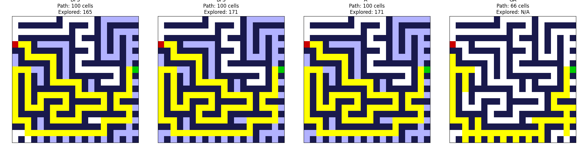</td>
    <td>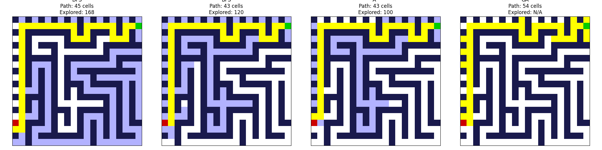</td>
    <td>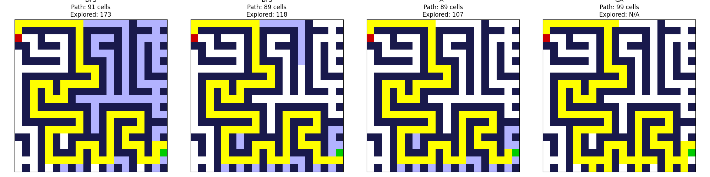</td>
  </tr>
  <tr>
    <td align="center">Trial 1 Results</td>
    <td align="center">Trial 2 Results</td>
    <td align="center">Trial 3 Results</td>
  </tr>
</table>

#### 30x30 Maze Comparisons
<table>
  <tr>
    <td>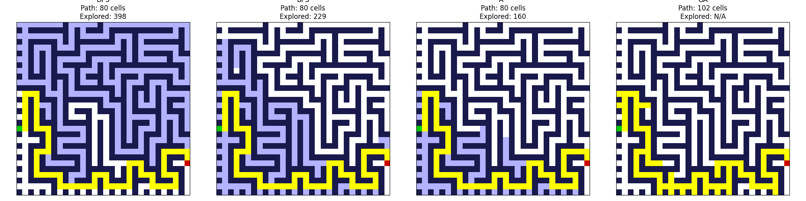</td>
    <td>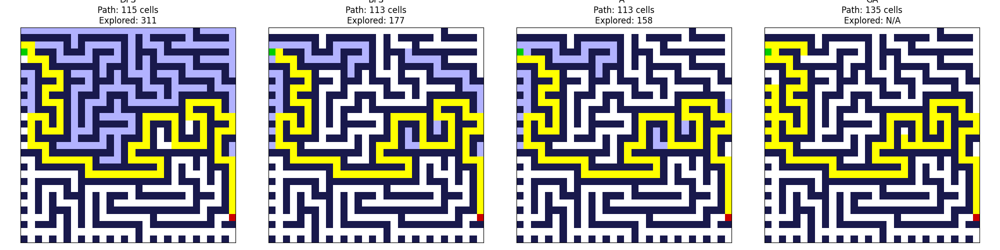</td>
    <td>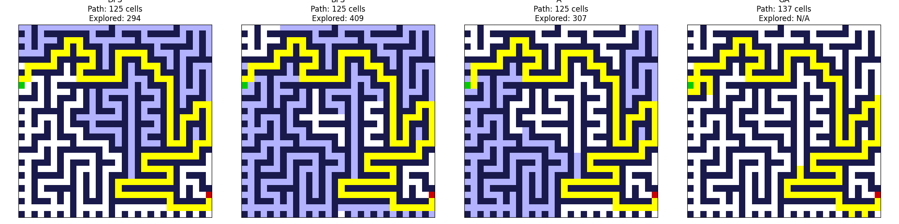</td>
  </tr>
  <tr>
    <td align="center">Trial 1 Results</td>
    <td align="center">Trial 2 Results</td>
    <td align="center">Trial 3 Results</td>
  </tr>
</table>

### Optimization Notes

- **GA Path Length Fix**: Implemented unique position counting for fair comparison
- **Neural Network**: Enhanced state representation with local maze information
- **Visualization**: Real-time rendering of solution paths and exploration patterns

## 🚧 Current Status

### ✅ Completed Features
- All traditional solving algorithms
- Genetic algorithm with optimized fitness function
- Prim's maze generation algorithm
- Comprehensive performance comparison
- Visualization system

### 🔄 Work in Progress
- **DQN Optimization**: Improving training stability for larger mazes
- **Progressive Training**: Starting near goal, expanding outward
- **Alternative Neural Networks**: Exploring MazeNet and PPO approaches

### 🔮 Future Enhancements
- Additional maze generation algorithms (Wilson's, Hunt-and-Kill)
- Web interface for interactive maze solving
- 3D maze support
- Multi-agent pathfinding

## 🤝 Contributing

Contributions are welcome! Please feel free to submit pull requests or open issues.

